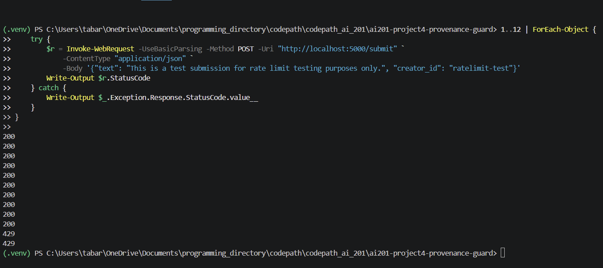

# Provenance Guard

Provenance Guard is a Flask API that classifies submitted text as AI-generated or human-written. It runs two independent detection signals — a Groq LLM classifier and a set of stylometric heuristics — combines their outputs into a calibrated confidence score, and returns a transparency label explaining the result to the creator. Creators who dispute a classification can submit an appeal, which is logged alongside the original decision for human review.

The system is designed for writing platforms that need to surface AI-generated content to their users without making overconfident claims. False positives — flagging human writing as AI — are treated as more damaging than false negatives, which is reflected in the wide uncertain band (0.36–0.74) and the 55/45 signal weighting that prevents the system from asserting a verdict when evidence is mixed.

---

## Architecture

A submission enters through the rate-limited `POST /submit` endpoint. Both signals run on the raw text in the same request, the confidence scorer combines their outputs, the label generator maps the score to one of three verbatim label strings, and the audit logger writes the complete structured entry to SQLite — all before the response is returned.

An appeal enters through `POST /appeal`, which looks up the record by `content_id` (404 if not found), updates its status, and appends the creator's reasoning to the same audit log entry. No re-classification occurs.

```
FLOW 1: SUBMISSION
──────────────────

  Client
    │
    │  POST /submit  {text, creator_id}
    ▼
┌─────────────┐
│ Rate Limiter│  ── 429 if over limit ──────────────────────────────► Client
└──────┬──────┘
       │  {text, creator_id}
       ▼
┌──────────────────┐
│ Submission       │  generates content_id (UUID)
│ Endpoint         │
│ POST /submit     │
└───┬──────────────┘
    │                          │
    │  raw text                │  raw text
    ▼                          ▼
┌──────────────┐       ┌──────────────────────┐
│ Signal 1     │       │ Signal 2             │
│ LLM          │       │ Stylometric          │
│ Classifier   │       │ Heuristics           │
│ (Groq API)   │       │ (pure Python)        │
└──────┬───────┘       └──────────┬───────────┘
       │  llm_score (0–1)         │  stylometric_score (0–1)
       └──────────┬───────────────┘
                  │
                  ▼
         ┌─────────────────┐
         │ Confidence      │
         │ Scorer          │
         │ (0.55/0.45 mix) │
         └────────┬────────┘
                  │  confidence (0–1) + attribution
                  ▼
         ┌─────────────────┐
         │ Label           │
         │ Generator       │
         └────────┬────────┘
                  │  label text (verbatim string)
                  ▼
         ┌─────────────────┐
         │ Audit Logger    │  writes structured entry to SQLite
         └────────┬────────┘
                  │
                  ▼
    {content_id, attribution, confidence, label, status} ──► Client


FLOW 2: APPEAL
──────────────

  Client
    │
    │  POST /appeal  {content_id, creator_reasoning}
    ▼
┌──────────────────┐
│ Appeal Endpoint  │
└───┬──────────────┘
    │  content_id
    ▼
┌──────────────────┐
│ Storage Lookup   │  ── 404 if not found ───────────────────────────► Client
└───┬──────────────┘
    │  record found
    ▼
┌──────────────────┐
│ Status Update    │  "classified" → "under_review"
└───┬──────────────┘
    │  updated record + creator_reasoning
    ▼
┌──────────────────┐
│ Audit Logger     │  appends appeal_reasoning, appeal_timestamp
└───┬──────────────┘
    │
    ▼
    {content_id, status: "under_review", message} ──► Client
```

**Storage:** SQLite (`audit_log.db`) via `db.py`. All signal scores, confidence, attribution, label, and appeal data are written to a single `audit_log` table. `GET /log` returns the 20 most recent entries as JSON.

---

## Rate Limiting

`POST /submit` is rate-limited to **10 requests per minute** and **100 requests per day** per IP address, enforced by Flask-Limiter. `POST /appeal` and `GET /log` are not rate-limited.

The per-minute limit of 10 prevents burst abuse. A creator submitting one piece at a time will never hit it; an automated script trying to probe the classifier or exhaust the Groq quota would be blocked within seconds. 10/min was chosen over a stricter limit (e.g. 3/min) because legitimate users doing milestone testing need to submit several inputs in quick succession without being blocked by their own tooling.

The per-day limit of 100 targets sustained high-volume use. Each `/submit` call triggers a Groq API call, which costs real tokens and incurs rate limits on the Groq side. 100 daily submissions per IP is far above any realistic individual use — even aggressive testing in a single session stays well under — while still creating a meaningful ceiling if someone runs a loop against the endpoint overnight.

Limiting by IP rather than by `creator_id` is a deliberate choice: `creator_id` is a self-reported string in the request body with no authentication behind it. Anyone could pass `creator_id: "someone_else"` to route around a per-creator limit. IP is the only enforceable identifier without adding a full auth layer, which is out of scope.

**Rate limit verification**

12 rapid requests sent to `POST /submit`. Requests 1–10 return `200 OK`; requests 11–12 return `429 Too Many Requests` once the 10/minute ceiling is hit.



---

## Detection Signals

**Signal 1 — LLM classifier (Groq / Llama-3.3-70b-versatile)**

Sends the raw text to the Groq API with a structured system prompt and returns `ai_score` (0–1) alongside a one-sentence reasoning string. The model assesses semantic and stylistic patterns holistically: characteristic hedging phrases ("it is important to note"), over-structured argumentation, unnaturally smooth transitions, absence of a specific personal voice, and uniform register across the whole piece.

This signal was chosen because it captures patterns that no surface heuristic can reach. A sentence like "Furthermore, the integration of machine learning algorithms has enabled unprecedented advancements" signals AI not through its length or punctuation but through its phrasing — something only a language model trained on massive text corpora can assess reliably. The prompt contract (`temperature=0.0`, strict JSON-only output, explicit 0–1 scale) keeps responses consistent across calls, and the output is clamped to `[0.0, 1.0]` before use in case of rounding edge cases.

What it misses: lightly edited AI output where a human has added personal details or broken the smooth register; formal human writing that uses the same diplomatic phrasing AI defaults to; non-native English speakers whose careful construction resembles AI output; and AI text that was explicitly prompted to sound casual or first-person.

**Signal 2 — Stylometric heuristics (pure Python)**

Computes three statistical surface properties, then blends them with calibrated phrase/register markers and casual human-voice markers into a single `stylometric_score` (0–1, higher = more AI-like):

- **Sentence length variance**: population standard deviation of per-sentence word counts, mapped via `1 - min(std_dev / 30, 1)`. Low variance → uniform rhythm → high score. AI text tends to cluster sentences around a comfortable medium; human writing is more irregular.
- **Type-token ratio (TTR)**: `unique_words / total_words`, mapped via `1 - min(ttr / 0.8, 1)`. Low TTR → repetitive vocabulary → high score. AI output within a single passage tends to reuse the same domain terms; human writing tends to paraphrase more.
- **Punctuation density**: `punctuation_marks / total_words`, mapped via `1 - min(density / 0.15, 1)`. Very low density → clean, rule-following prose → high score. Human writing uses punctuation more idiosyncratically (em dashes, ellipses, fragments).
- **Register and voice markers**: generic AI-like phrases such as "it is important to note," "paradigm shift," "stakeholders," "studies show," and "on the other" raise the score; casual first-person markers such as "ok so," "honestly?", "my friend," and "probably won't" lower it.

This signal was chosen because it is fully independent of the LLM — no API call, no network dependency, deterministic output for the same input. That independence matters for the scoring design: when both signals agree, confidence rises; when they disagree, the combined score sits in the uncertain band. A second LLM call would not provide this independence since both calls would share the same underlying model biases.

What it misses: texts under ~80 words, where TTR is unreliable at small sample sizes and sentence variance is unstable with fewer than three sentences (the code falls back to `sent_score = 0.5`); genre-specific formal writing (legal, academic, technical) where structural uniformity is a professional convention, not an AI signature; and AI text deliberately prompted to introduce variety.

---

## Confidence Scoring

The confidence score is a weighted blend of the two signals: `0.55 × llm_score + 0.45 × stylometric_score`. Scores ≥ 0.75 map to `likely_ai`, ≤ 0.35 map to `likely_human`, and everything in between is `uncertain`. The wide uncertain band is intentional — the system treats false positives as more costly than false negatives.

The weights were refined during Milestone 4 testing. The initial split was 65/35 (LLM/stylometric). Calibration runs on four labeled inputs revealed that at 65/35 the stylometric signal had negligible influence on borderline cases — the LLM score alone was effectively deciding the outcome. After rebuilding the stylometric function with AI phrase markers and human-voice markers (in addition to the original three surface metrics), the weight was adjusted to 55/45 to give the stronger signal meaningful leverage. 55/45 keeps the LLM's holistic read as the dominant input while letting stylometric evidence tip borderline calls.

The examples below are taken from Milestone 4 testing and show that the scorer produces real variation across inputs, not a constant output.

**Example 1 — high confidence AI-generated text**

Input (formal, uniform-sentence-length AI prose):
```
Artificial intelligence (AI) has emerged as a transformative technology with
far-reaching implications across numerous sectors. It is important to note that
its impact extends beyond mere automation, encompassing complex decision-making
processes that were previously exclusive to human cognition. Furthermore, the
integration of machine learning algorithms has enabled unprecedented advancements
in data analysis and pattern recognition.
```

Response:
```json
{
  "attribution": "likely_ai",
  "confidence": 0.7579,
  "llm_score": 0.8,
  "stylometric_score": 0.7065,
  "label": "AI-assisted content detected. Our system found strong indicators that this content was likely generated or substantially written by an AI tool (confidence: 76%). If this classification is wrong, the creator can submit an appeal."
}
```

**Example 2 — lower confidence, human-written text**

Input (casual, conversational, irregular punctuation):
```
i was making eggs this morning and dropped the whole carton on the floor. like,
all 12. just gone. the dog was thrilled obviously. i just stood there for a second
not sure if i should laugh or cry, decided on both
```

Response:
```json
{
  "attribution": "likely_human",
  "confidence": 0.189,
  "llm_score": 0.2,
  "stylometric_score": 0.1755,
  "label": "Appears human-written. Our system found strong indicators that this content was written by a human (confidence: 81% human). No action is required."
}
```

The 0.569-point gap between these two cases (0.7579 vs 0.189) spans the full `likely_ai`-to-`likely_human` range. Both signals agree in each direction: for the AI text the LLM scores 0.8 and stylometrics score 0.71 (uniform sentence lengths, lower TTR); for the human text the LLM scores 0.2 and stylometrics score 0.18 (short irregular sentences, high punctuation density relative to word count). The two signals pulling the same way in both cases is what pushes the scores to the extremes rather than landing in the uncertain band.

---

## Transparency Labels

The label generator maps every result to one of three verbatim strings based on the attribution value. The text is designed for a non-technical creator reading it on a writing platform — it communicates the verdict, the system's certainty level, and next steps in plain language.

**`likely_ai` — confidence ≥ 0.75**

> AI-assisted content detected. Our system found strong indicators that this content was likely generated or substantially written by an AI tool (confidence: {pct}%). If this classification is wrong, the creator can submit an appeal.

The percentage is `round(confidence * 100)` — it expresses confidence in the AI verdict. Every `likely_ai` label mentions appeals because this is the verdict most likely to be disputed.

**`uncertain` — confidence 0.36–0.74**

> Attribution unclear. Our system found mixed signals for this content and cannot confidently determine whether it was written by a human or generated by AI (confidence: {pct}%). We've flagged it for transparency, but the creator may contest this classification through an appeal.

The percentage is again `round(confidence * 100)`. This label deliberately avoids asserting a verdict — "mixed signals" and "cannot confidently determine" are chosen to prevent a false-certainty read. Appeals are mentioned here as well.

**`likely_human` — confidence ≤ 0.35**

> Appears human-written. Our system found strong indicators that this content was written by a human (confidence: {pct}% human). No action is required.

The percentage is `round((1 - confidence) * 100)` — it expresses confidence in the human verdict, not in AI-ness, so a score of 0.28 reads as "72% human" rather than "28% AI." This is the only label that does not mention appeals; there is nothing for the creator to contest.

All three variants are reachable through `POST /submit` by submitting content that lands in each confidence zone. Verified during Milestone 5 testing.

---

## Known Limitations

**Formal human writing is the system's most likely false-positive source.** The sentence length variance heuristic treats low variance as an AI signal — but low variance is also a property of careful, edited prose. A short scientific abstract with four sentences averaging 11–13 words each produces a `sent_score` near 0.95, indistinguishable from AI output. A formal academic text tested against the system returned `stylometric_score: 0.3631` — near the human boundary — only because its low type-token ratio (domain vocabulary repeated across sentences) partially cancels the sentence regularity signal. That cancellation is accidental, not designed. A slightly longer abstract where the domain terms don't repeat as much would push the stylometric score higher and pull the overall confidence toward `uncertain` or beyond. There is no feature in the stylometric signal that distinguishes "uniform because AI" from "uniform because edited."

The LLM signal compounds this for formal writing. The classifier (Llama-3.3-70b-versatile) is a general-purpose language model, not a purpose-built detector. It was trained on a corpus that includes large amounts of AI-generated text, which skews toward formal, structured prose. When a human writes in that register — grant proposals, medical summaries, technical reports — the model has less basis for distinguishing it from AI output and tends to return elevated `ai_score` values. Since the LLM carries 55% of the final weight — reduced from the initial 65% after calibration testing showed it was dominating borderline decisions — a moderate LLM score on formal human text is still enough to land the result in the uncertain band or above even when the stylometrics are neutral. The reweight helped at the extremes but did not eliminate this pattern for inputs the LLM reads as formal-but-ambiguous.

The practical consequence: the system is more reliable for clearly casual human text than for carefully edited human text, and more reliable for generic AI output than for AI text that was prompted to sound informal or first-person. Content in the uncertain band (confidence 0.36–0.74) should not be acted on without human review — the wide band exists precisely because these signals cannot resolve ambiguous cases.

---

## AI Usage

**Instance 1 — implementing the stylometric heuristics**

The planning document had fully specified all three normalization formulas before any code was written: sentence length variance mapped via `1 - min(std_dev / 30, 1)`, TTR via `1 - min(ttr / 0.8, 1)`, punctuation density via `1 - min(density / 0.15, 1)`. I directed the AI to implement `compute_stylometrics()` from those formulas, and it produced the function in a single pass — correctly using population standard deviation (not sample), correctly stripping punctuation from tokens before the TTR set, and adding section-header comments for each heuristic. The code was accepted without structural change.

What required revision was the interpretation of the output. When the four test inputs were run through both signals in the comparison table, clearly-human casual text scored `stylometric_score: 0.278` and clearly-AI formal text scored `stylometric_score: 0.2956` — a gap of 0.018 points, effectively noise. The stylometric signal was not separating those two inputs at all. The AI had implemented the formulas exactly as specified; the problem was in the spec's assumption that the normalization ceilings (30, 0.8, 0.15) would produce meaningful spread across real inputs.

Rather than asking the AI to recalibrate the ceilings, the approach changed entirely. The stylometric function was rebuilt to incorporate AI phrase markers ("transformative," "it is important to note," "stakeholders," etc.) and human-voice markers ("ok so," "honestly?," "my friend") alongside the original surface metrics. At the same time, the LLM weight was dropped from 65% to 55% — the original 65/35 split meant the LLM was deciding borderline cases on its own, with the stylometric score barely moving the needle. At 55/45 the retooled phrase-marker component has enough leverage to tip borderline calls and lift generic AI prose above the `likely_ai` threshold even when the LLM is only moderately confident. The stylometric signal's real value in the current system is exactly those borderline cases — it acts as a tiebreaker when the LLM score lands in the 0.50–0.75 range.

**Instance 2 — wiring the LLM signal into `/submit` before Signal 2 was ready**

I directed the AI to connect the working LLM classifier into the submission endpoint as an intermediate step, explicitly noting that the blended scorer didn't exist yet and the wiring should be temporary. It produced a version of `/submit` that assigned `confidence = llm_score` directly and applied the attribution thresholds to the raw LLM score inline — with an if/elif block inside the route function itself and a placeholder label string ("Preliminary classification — full analysis pending."). This matched the instruction: get real scores flowing before the full pipeline was assembled.

When Signal 2 and the confidence scorer landed, I directed the AI to replace this intermediate. The override was more complete than a simple substitution. The if/elif attribution block was removed from `app.py` entirely — along with the direct `confidence = llm_score` line — and the route was refactored to delegate everything to the signals module: `classify_with_llm`, `compute_stylometrics`, `compute_confidence`, `generate_label` each called in sequence with no logic in the route itself. I pushed this direction specifically because keeping the threshold logic in the route (even updated for the blended score) would have split the classification logic across two files. The AI produced a clean delegation-only route on the first attempt, but that structure came from an explicit instruction, not from the AI proposing it on its own.

---

## Spec Reflection

**Where the spec guided the implementation.**

The planning document worked through a specific false-positive scenario before any code was written: a non-native English speaker submitting a careful, formal personal essay that both signals would read as AI-generated. The conclusion from that exercise was that the cost of false positives on a writing platform is asymmetric — a wrongly flagged human creator has real recourse consequences, while a missed AI submission is a softer failure. That reasoning produced two concrete decisions that show up directly in the code.

First, it set the uncertain band wide (0.36–0.74) rather than the more intuitive (0.45–0.55). A system with a narrow uncertain zone would force a confident-looking label onto a score of 0.68 even though one signal agreed and the other hedged. The `compute_confidence` function's thresholds — `≥ 0.75` for `likely_ai` and `≤ 0.35` for `likely_human` — are not arbitrary round numbers; they came directly from reasoning about where the system should and shouldn't be willing to make a strong claim.

Second, it determined that individual signal scores had to be stored in the audit log separately from the combined score. The spec noted that a human reviewer seeing `llm_score: 0.79, stylometric_score: 0.63` can tell the signals partially disagreed and weight an appeal accordingly — whereas a reviewer who only sees `confidence: 0.71` cannot. The `audit_log` table schema stores `llm_score` and `stylometric_score` as distinct columns because the spec made the case that the combined score alone is not enough for a meaningful human review.

**Where the implementation diverged from the spec.**

The spec defined `GET /log` with an optional `?limit=N` query parameter, defaulting to all entries. The implementation does not support it. `view_log()` in `app.py` calls `read_log()` with no arguments, and `read_log()` in `db.py` hardcodes `LIMIT 20` unconditionally — the query parameter is never read.

The divergence happened for a straightforward reason: `GET /log` existed for audit visibility during testing and grading, not as a production query interface. During implementation, the focus was on getting the detection pipeline and appeal workflow correct, and the configurable limit was a secondary concern that was never wired up. The hardcoded 20 was sufficient for every real use of the endpoint during the project, so nothing surfaced the gap. The spec's `?limit=N` design was the right call for a real system — a reviewer working through a large backlog of appeals needs to fetch more than 20 records — but the project's actual usage pattern never created pressure to implement it.
